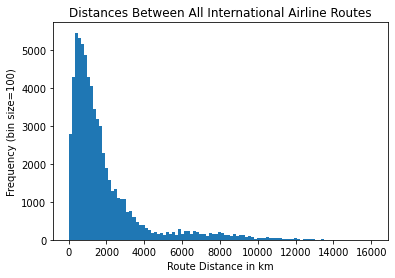

# **Analyzing Airport Data**

This repo contains two datasets which were downloaded to a local drive; one is all international airports (airports.dat) and a second is all airline routes (routes.dat).  We would like to calculate and vizualise the distances between airports using the information within these datasets.  Also in this repo is a script, CompProg_Lab5.ipyb, which contains four coding challenges and one beginning exercise.  The exercises utilizes a .csv of refugee camps to familiarize the user with importing and displaying .csv files.

## Challenge 1: 

In Challenge 1, we would like to print the names of all airports within Argentina.  The process is as follows:
1.  Upload the airports.dat from the local drive.
2.  Import .csv module and open the airports dataset.
3.  A *for* loop is created which queries 'Argentina' in the country field and prints the airport name from the airport name field for each row in the dataset.

##  Challenge 2:

In Challenge 2, two dictionaries are created which the key, value pairs of airport ID, location latitude and airport ID, location longitude.
1.  First, three empty lists are created; one for the airport ID, another for the latitude, and a last for the longitude.
2.  Next the csv module is imported and the airports dataset is read.
3.  A *for* loop is created which for each row, the airport ID, latitude and longitude are added to their corresponding empty list.
4.  Two dictionaries are then created by zipping the airport ID list and latitude list and zipping the airport ID list and the longitude list.

##  Challenge 3:

In Challenge 3, the distance is calculated for each travel route using the dictionaries created in Challenge 2 and the Haversine formula for geographic Great Circle Distance.
1.  routes.dat is uploaded from the local drive.
2.  An empty list for the calculated distances, distancesList, is created.
3.  routes.dat is then opened.
4.  Next, a *for* loop is created which calculates the distance and add the distance to the empty this by doing the following:
    a.  The source airport ID and destination airport ID are found from their respective fields.
    b.  If the source is which the latitude and longitude dictionaries (to remove NO VALUES), the latitude and longitude are assigned to lat1 and long1 for the source airport and the latitude and longitude are assigned to lat2 and long2 for the destination airport using the get functionn.
    c.  lat1, lat2, long1, and long2 are inputted into the Haversine formula and the output is added to distancesList.

##  Challenge 4:

In Challenge 4, a histogram is created using the distancesList created in Challenge 3.  By importing numpy and matplotlib.pyplot, a histogram is plotted with the distancesList as the input and a bin size of 100.  x and y axis labels as well as a title are then added.

The following is the histogram that is created of travel distances of all international airport travel routes.  The x axis is route distances and the y axis is the number of flights.

